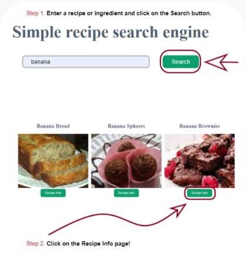

Installatiehandleiding

Inleiding

This application provides users a simple way to calculate your calorie intake and the ability to search for recipes and cooking instructions.

Requirements

- To run this application you need an IDE, for example; Webstorm, Visual Studio Code, Eclipse or any other.
- You need an API key provided by Spoonacular, you can register a free key to make limited get requests. Link: https://spoonacular.com/food-api

API-Key Installation

- ../src/components/search-recipes/Recipes.js line 9. const apiKey = "?apiKey=YOUR\_KEY"
- ../src/pages/Recipe.js: line 12. const apiKey = "?apiKey=YOUR\_KEY"

Start the Project from your IDE

- Install Node.js and NPM on your system, follow the provided instructions, link: https://docs.npmjs.com/downloading-and-installing-node-js-and-npm
- On your IDE terminal run the following "npm install", to install required dependencies like Axios, React-router-dom, Eslin, Jwt-decode, and so on.

Getting started

1. Launch the web application: type "npm start" on your IDE terminal. The web application will start on your browser at:  http://localhost:3000
1. Click on the Sign up button and register an account, enter your user account information and press the "Sign Up" button.

3. You will get redirected on the log in page, enter your user account information that has been provided on the sign up page, and press the "Log in" button

4. You have been directed back to the homepage. To use the recipe we provided the instructions from the "Our Page" link available on the web application for visiting users.

5. You can use the calculator without being required to log in. Click on "Calculate" to view your calories calculations.

Please note to fill in all the fields, otherwise you'll be prompted with a warning message.

Styling

The Styling on the pages have been dynamically set up using CSS - Flexbox. You can re-use components to create new pages, while maintaining the same look and feel. **To get the best viewing experience set your browser width at 1440PX.**
